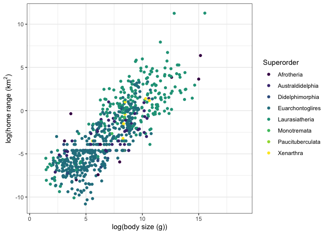
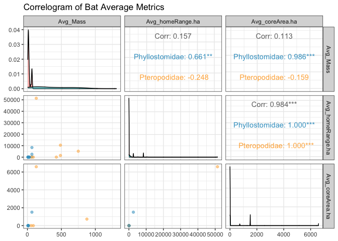
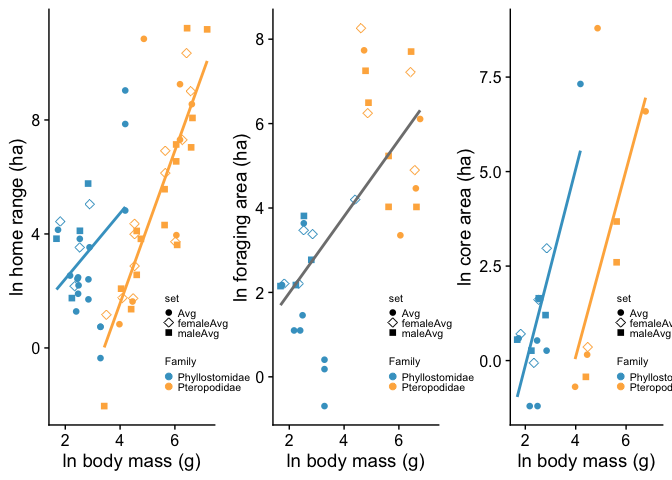
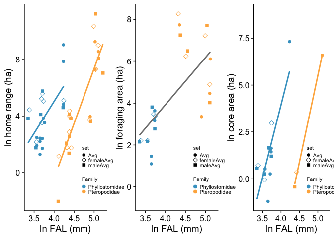
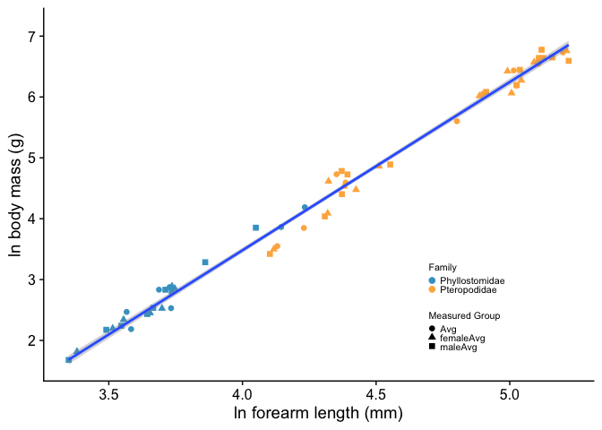

## Frugivorous bat movement

Among the large order of bats there has been two independent evolutions of fruigovory: the American Phyllostomidae (leaf-nosed bats) and the Afro-Asian Pteropodidae (fruit bats and flying foxes). While nominally similar, the size and distribution of their targeted fruit resources may be directly related to both body size (phyllostomids are generally smaller than pteropodids) and phylogeny. Using movement data derived from the literature, we'll test how body size and Family-level members impacts frugivore movement. 

## Body size & home range
In mammals, home range positively scales with body size. We can show this using the data from the Pantheria life history data bases. This is compiled from the literature & some models to describe biological patterns in mammals and published in 2009 as a data paper in *Ecology*. This (and many other data sets) can be downloaded from the Ecological Data Wiki (https://ecologicaldata.org/home).

Because mammals span a larger scale of body size than any other vertebrate order (probably invertebrate too, tbh), we'll take the natural log of both body mass and home range. Bats are part of the Laurasiatheria, but unfortunately don't have any home ranges recorded in Pantheria.

Even though this relationship is a bit loose, this gives us the **a priori** expectation that home range should scale with body size. 


```r
library(tidyverse) #Note -- you only have to do this once per R Session
library(googlesheets4) #This package lets you connect to Google Drive
gs4_deauth() #This tells Google Sheets that you won't need to login. It's an open sheet.
mammals <- read.csv("https://github.com/teague0/mammalogy2020/raw/master/data/PanTheriaData.csv")
bats <- mammals %>% filter(Order == "Chiroptera")

ggplot()+
  geom_point(data = mammals, 
             aes(x = log(AdultBodyMass_g),  y = log(HomeRange_km2), color = Superorder))+
  scale_color_viridis_d()+
  xlab("log(body size (g))")+
  ylab(expression(paste("log(home range (", km^2, ")", sep = "")))+
  theme_bw()
```

<!-- -->


### Read in Dani's data

```r
library(tidyverse)
library(readxl)
library(cowplot)

dat <- read_xlsx("./data/Frugivore data 8 (10-17-2021).xlsx")
dat <-  dat %>% mutate(speciesName = paste0(Genus, ".", Species))
```


### Dani's Figure Ideas

1. Body weight on x axis, and home range, foraging range, core range on y axis (likely will be 3 separate figures with each range as their own figure).
2. Forearm length on x axis, and home range, foraging range, core range on y axis (again 3 different figures otherwise the range of the y axis will be too big to show core range).
3. I think I would like to do a bar graph showing the average home range for males in both families and females in both families and hopefully there will be significance and can label the bars.  Probably do that with both core range and foraging range as well. 
4. I would like to examine the difference between kernel/MAP and MCP but I'm not entirely sure how to do that without just seeing if the ranges are different. I think we would need more bat ranges that have been evaluated using both methods, but maybe we can do a small analysis of the ones that have both. 


### Clean data up a bit

The first thing I need to do is pull out the ranges + morphometric data into a long format. Focus on the foraging, core, and home range.


```r
#The yellow columns in the Excel file are ready to run

cleanDat <- dat %>% dplyr::select(Family, 
                           Genus, 
                           Species, 
                           Avg_Mass = `Body Weight Average Sex Unspecified (g)`, 
                           maleAvg_Mass = `Male Weight Average (g)`,
                           femaleAvg_Mass = `Female Weight Average (g)`,
                           Avg_FAL = `Average Forearm Length Sex Unspecified (mm)`,
                           maleAvg_FAL = `Forearm Length Male average (mm)`,
                           femaleAvg_FAL = `Forearm Length Female Average (mm)`,
                           telemetryType = `Recording method simplified`,
                           Avg_homeRange.ha = `Home Range average Sex unspecified (ha)`,
                           maleAvg_homeRange.ha = `Male Average (ha)`,
                           femaleAvg_homeRange.ha = `Female Average (ha)`,
                           homeRangeMetric = `Recording Metric for Anlaysis`,
                           Avg_coreArea.ha = `Core Area Average Sex Unspecified (ha)`,
                           maleAvg_coreArea.ha = `Core Area Male Average (ha)`,
                           femaleAvg_coreArea.ha = `Core Area Female Average (ha)`,
                           coreAreaMetric = `Recording Metric for Analysis...71`,
                           Avg_foragingArea.ha = `Foraging Range Average Sex Unspecified (ha)`,
                           maleAvg_foragingArea.ha = `Foraging Area Male Average (ha)`,
                           femaleAvg_foragingArea.ha = `Foraging Range Average Female (ha)`,
                           foragingAreaMetric = `Recording Metric for Analysis...86`,
                           #Avg_forageRoostDist = `distance from roost to foraging range m`,
                           #maleAvg_forageRoostDist = `distance roost to forage male`,
                           #femaleAvg_forageRoostDist = `distance roost to forage female`,
                           #nRoosts = `Number of Roosts`,
                           #individualForagingOverlap = `Foraging overlap between individuals`,
                           #Avg_dailyPathLength = `Daily Flight Path (no sex recorded)`,
                          #male_dailyPathLength = `Daily Path Length Male`,
                           #female_dailyPathLength = `Daily Path Length Female`,
                           #groundSpeed = `Ground Speed`,
                           #Avg_totalFlightDistance = `Total Flight Distance at Night (no sex distinguishing, km)`,
                           #male_totalFlightDistance.km = `Average Flight Distance per night (Male, km)`,
                           #female_totalFlightDistance.km = `Average Flight Distance per night (Female, km)`,
                           #numberForagingSites = `Number of Foraging sites`
                           )
cleanDat$Avg_foragingArea.ha <- as.numeric(cleanDat$Avg_foragingArea.ha)
cleanDat$Family <- dplyr::recode(cleanDat$Family, phyllostomidae = "Phyllostomidae", phyllostomatidae = "Phyllostomidae")

cleanDat$Species <- dplyr::recode(cleanDat$Species, walbergi = "wahlbergi")
cleanDat$speciesName <-  paste0(cleanDat$Genus, ".", cleanDat$Species)
```

### What do the data look like?
We should look at some distributions of the different data first to have an idea of what we may be dealing with. We can plot a correlogram matrix


<!-- -->


### Body mass, range sizes & Phylogeny

>1. Body weight on x axis, and home range, foraging range, core range on y axis (likely will be 3 separate figures with each range as their own figure).

In the following plots, Family is shown by color and the range metric by the filled shape. I added in the separate female (asterisk )and male ranges (open circle) as well.


```r
myFamcols <- c("#43a2ca", "#feb24c")
mySetShapes <- c(16, 5, 15)
leg.pos <- c(0.7, 0.2)
addSmallLegend <- function(myPlot, pointSize = 2, textSize = 8, spaceLegend = 0.2) {
    myPlot +
        guides(shape = guide_legend(override.aes = list(size = pointSize)),
               color = guide_legend(override.aes = list(size = pointSize))) +
        theme(legend.title = element_text(size = textSize), 
              legend.text  = element_text(size = textSize),
              legend.key.size = unit(spaceLegend, "lines"))
}

hrdat <- cleanDat %>% select(Family, speciesName, homeRangeMetric, Avg_Mass, maleAvg_Mass, femaleAvg_Mass, Avg_homeRange.ha, maleAvg_homeRange.ha, femaleAvg_homeRange.ha) %>% 
  pivot_longer(Avg_Mass:femaleAvg_homeRange.ha,
               names_to = c("set", ".value"),
               names_pattern = "(.+)_(.+)")

hr <- ggplot(hrdat)+
  geom_point(aes(x = log(Mass), y = log(homeRange.ha), 
                 shape = set, color = Family), size = 2)+
  scale_color_manual(values = myFamcols)+
  scale_shape_manual(values = c(16, 5, 15))+
  geom_smooth(aes(x = log(Mass), y = log(homeRange.ha)),
                 method = "lm", se = FALSE,
                 data = hrdat[hrdat$Family == "Phyllostomidae",],
                 color = myFamcols[1])+
   geom_smooth(aes(x = log(Mass), y = log(homeRange.ha)),
                 method = "lm", se = FALSE,
                 data = hrdat[hrdat$Family == "Pteropodidae",],
                 color = myFamcols[2])+
  labs(x = "ln body mass (g)", y = "ln home range (ha)")+
  theme_cowplot()+
  theme(legend.position = leg.pos)
hr <- addSmallLegend(hr)

crdat <- cleanDat %>% select(Family, speciesName, coreAreaMetric, Avg_Mass, maleAvg_Mass, femaleAvg_Mass, Avg_coreArea.ha, maleAvg_coreArea.ha, femaleAvg_coreArea.ha) %>% 
  pivot_longer(Avg_Mass:femaleAvg_coreArea.ha,
               names_to = c("set", ".value"),
               names_pattern = "(.+)_(.+)")

cr <- ggplot(crdat)+
  geom_point(aes(x = log(Mass), y = log(coreArea.ha), 
                 shape = set, color = Family), size = 2)+
  scale_color_manual(values = myFamcols)+
  scale_shape_manual(values = c(16, 5, 15))+
  geom_smooth(aes(x = log(Mass), y = log(coreArea.ha)),
                 method = "lm", se = FALSE,
                 data = crdat[crdat$Family == "Phyllostomidae",],
                 color = myFamcols[1])+
   geom_smooth(aes(x = log(Mass), y = log(coreArea.ha)),
                 method = "lm", se = FALSE,
                 data = crdat[crdat$Family == "Pteropodidae",],
                 color = myFamcols[2])+
  labs(x = "ln body mass (g)", y = "ln core area (ha)")+
  theme_cowplot()+
  theme(legend.position = leg.pos)
cr <- addSmallLegend(cr)

frdat <- cleanDat %>% select(Family, speciesName, foragingAreaMetric, Avg_Mass, maleAvg_Mass, femaleAvg_Mass, Avg_foragingArea.ha, maleAvg_foragingArea.ha, femaleAvg_foragingArea.ha) %>% 
  pivot_longer(Avg_Mass:femaleAvg_foragingArea.ha,
               names_to = c("set", ".value"),
               names_pattern = "(.+)_(.+)")

fr <- ggplot(frdat)+
  geom_point(aes(x = log(Mass), y = log(foragingArea.ha), 
                 shape = set, color = Family), size = 2)+
  scale_color_manual(values = myFamcols)+
  scale_shape_manual(values = c(16, 5, 15))+
  geom_smooth(aes(x = log(Mass), y = log(foragingArea.ha)),
                 method = "lm", se = FALSE,
                 data = frdat,
                 color = "grey50")+
  labs(x = "ln body mass (g)", y = "ln foraging area (ha)")+
  theme_cowplot()+
  theme(legend.position = leg.pos)
fr <- addSmallLegend(fr)

plot_grid(hr, fr, cr, cols = 3)
```

<!-- -->

I see a few things from these plots.
**1. Home Range.** It looks like the size of home range scales pretty nicely with body size. There is a phylogenetic shift between the two families -- when we run a model to test this, I'm pretty sure that we will see the same slope of the line that describes how body mass & home range size scale, but that the pteropodids will the shifted down (they'll have a lower y intercept). So, for a given body size pteropodids have *small* home ranges. This is cool! I need to reformat the data to run it through a glm because I think I want to include both the sex-segregated data with the species averages.

Below is a linear model that tests for effects of body size and Family designation (and their interaction) on home range size. I've included all of the data (male, female, average) to beef up the sample size.

```r
library(car)
allHRdat <- cleanDat %>% dplyr::select(Family, speciesName, Avg_Mass, maleAvg_Mass, femaleAvg_Mass, Avg_homeRange.ha, maleAvg_homeRange.ha, femaleAvg_homeRange.ha) %>% 
  pivot_longer(Avg_Mass:femaleAvg_homeRange.ha,
               names_to = c("set", ".value"),
               names_pattern = "(.+)_(.+)"
  ) %>% 
  group_by(Family, speciesName, set) %>% 
  summarize(mass.avg = mean(Mass, na.rm = T),
            homeRange.avg = mean(homeRange.ha, na.rm = T)) %>% 
  filter(!is.na(homeRange.avg))

#This fits a lm of log mass prediction homerange size with Family as a covariate
hrMassPhyl <- lm(log(homeRange.avg)~log(mass.avg)*Family, data = allHRdat)
Anova(hrMassPhyl, type = 2)
```

```
## Anova Table (Type II tests)
## 
## Response: log(homeRange.avg)
##                       Sum Sq Df F value    Pr(>F)    
## log(mass.avg)        210.939  1  48.627 1.797e-08 ***
## Family                74.582  1  17.193 0.0001653 ***
## log(mass.avg):Family   9.370  1   2.160 0.1492804    
## Residuals            177.854 41                      
## ---
## Signif. codes:  0 '***' 0.001 '**' 0.01 '*' 0.05 '.' 0.1 ' ' 1
```
I've specified type = 2 to use type II sums of squares. If there were a significant interaction effect, we'd switch to type III (https://www.r-bloggers.com/2011/03/anova-%E2%80%93-type-iiiiii-ss-explained/). Those results show a couple of things. First, the slope of log(mass.avg) differs from 0 and Family has a significant effect. There is no interaction effect between log(mass.avg) & Family (log(mass.avg):Family). So the interpretation under the plots is accurate. 

If we want the coefficients of the regression, we can ask for those directly

```r
coef(hrMassPhyl)
```

```
##                      (Intercept)                    log(mass.avg) 
##                        0.5432439                        1.1157918 
##               FamilyPteropodidae log(mass.avg):FamilyPteropodidae 
##                       -8.8253883                        1.3631136
```

And here is a summary of that regression that will also show the adjusted R2 (0.5629). The full F-stat reporting is at the bottom of the summary. We can talk about what these mean. A short explainer: https://feliperego.github.io/blog/2015/10/23/Interpreting-Model-Output-In-R

```r
summary(hrMassPhyl)
```

```
## 
## Call:
## lm(formula = log(homeRange.avg) ~ log(mass.avg) * Family, data = allHRdat)
## 
## Residuals:
##     Min      1Q  Median      3Q     Max 
## -4.3512 -1.0671  0.0321  0.9578  7.0622 
## 
## Coefficients:
##                                  Estimate Std. Error t value Pr(>|t|)   
## (Intercept)                        0.5432     2.2077   0.246  0.80686   
## log(mass.avg)                      1.1158     0.8574   1.301  0.20038   
## FamilyPteropodidae                -8.8254     2.9664  -2.975  0.00489 **
## log(mass.avg):FamilyPteropodidae   1.3631     0.9275   1.470  0.14928   
## ---
## Signif. codes:  0 '***' 0.001 '**' 0.01 '*' 0.05 '.' 0.1 ' ' 1
## 
## Residual standard error: 2.083 on 41 degrees of freedom
##   (10 observations deleted due to missingness)
## Multiple R-squared:  0.5958,	Adjusted R-squared:  0.5662 
## F-statistic: 20.15 on 3 and 41 DF,  p-value: 3.511e-08
```

**2. Foraging Area.** Here, I see that there is one scaling relationship between the 2 families and that they are just segregated by size. 


```r
allFRdat <- cleanDat %>% dplyr::select(Family, speciesName, Avg_Mass, maleAvg_Mass, femaleAvg_Mass, Avg_foragingArea.ha, maleAvg_foragingArea.ha, femaleAvg_foragingArea.ha) %>% 
  pivot_longer(Avg_Mass:femaleAvg_foragingArea.ha,
               names_to = c("set", ".value"),
               names_pattern = "(.+)_(.+)"
  ) %>% 
  group_by(Family, speciesName, set) %>% 
  summarize(mass.avg = mean(Mass, na.rm = T),
            foragingRange.avg = mean(foragingArea.ha, na.rm = T))
allFRdat <- allFRdat %>% filter(!is.na(foragingRange.avg))

#This fits a glm of log mass prediction homerange size with Family as a covariate
frMassPhyl <- lm(log(foragingRange.avg)~log(mass.avg)*Family, data = allFRdat)
Anova(frMassPhyl, type = 2)
```

```
## Anova Table (Type II tests)
## 
## Response: log(foragingRange.avg)
##                      Sum Sq Df F value   Pr(>F)   
## log(mass.avg)         0.206  1  0.0960 0.759308   
## Family               18.575  1  8.6666 0.006906 **
## log(mass.avg):Family  4.036  1  1.8831 0.182176   
## Residuals            53.582 25                    
## ---
## Signif. codes:  0 '***' 0.001 '**' 0.01 '*' 0.05 '.' 0.1 ' ' 1
```
The ANOVA table shows there is no interaction effect of family but that pteropodids are shifted higher. 

Full model output:

```r
summary(frMassPhyl)
```

```
## 
## Call:
## lm(formula = log(foragingRange.avg) ~ log(mass.avg) * Family, 
##     data = allFRdat)
## 
## Residuals:
##     Min      1Q  Median      3Q     Max 
## -3.5806 -0.8827  0.1096  0.9924  2.2718 
## 
## Coefficients:
##                                  Estimate Std. Error t value Pr(>|t|)  
## (Intercept)                        1.1812     1.4887   0.793   0.4350  
## log(mass.avg)                      0.5094     0.5753   0.886   0.3843  
## FamilyPteropodidae                 7.4505     3.0056   2.479   0.0203 *
## log(mass.avg):FamilyPteropodidae  -1.0055     0.7327  -1.372   0.1822  
## ---
## Signif. codes:  0 '***' 0.001 '**' 0.01 '*' 0.05 '.' 0.1 ' ' 1
## 
## Residual standard error: 1.464 on 25 degrees of freedom
##   (8 observations deleted due to missingness)
## Multiple R-squared:  0.6153,	Adjusted R-squared:  0.5691 
## F-statistic: 13.33 on 3 and 25 DF,  p-value: 2.15e-05
```

**3. Core Area.** This looks like the Home Range data. Same scaling relationship, but shifted by family.

So depending on what the lms show, we have to think about what this means. Why are the ranges shifted between the 2 families, but the foraging area shows a simple, linear relationship?


```r
allCoredat <- cleanDat %>% dplyr::select(Family, speciesName, Avg_Mass, maleAvg_Mass, femaleAvg_Mass, Avg_coreArea.ha, maleAvg_coreArea.ha, femaleAvg_coreArea.ha) %>% 
  pivot_longer(Avg_Mass:femaleAvg_coreArea.ha,
               names_to = c("set", ".value"),
               names_pattern = "(.+)_(.+)"
  ) %>% 
  group_by(Family, speciesName, set) %>% 
  summarize(mass.avg = mean(Mass, na.rm = T),
            coreRange.avg = mean(coreArea.ha, na.rm = T))
allCoredat <- allCoredat %>% filter(!is.na(coreRange.avg))

#This fits a lm of log mass prediction homerange size with Family as a covariate
coreMassPhyl <- lm(log(coreRange.avg)~log(mass.avg)*Family, data = allCoredat)
Anova(coreMassPhyl, type = 2)
```

```
## Anova Table (Type II tests)
## 
## Response: log(coreRange.avg)
##                      Sum Sq Df F value    Pr(>F)    
## log(mass.avg)        74.748  1 20.9194 0.0001842 ***
## Family               34.687  1  9.7077 0.0054471 ** 
## log(mass.avg):Family  0.001  1  0.0003 0.9864440    
## Residuals            71.463 20                      
## ---
## Signif. codes:  0 '***' 0.001 '**' 0.01 '*' 0.05 '.' 0.1 ' ' 1
```
Here Family has no effect. So the slopes are the same between the families AND they are interspersed among each other. That's not really how the plots look, so we need to go back & re-evaluate.


```r
summary(coreMassPhyl)
```

```
## 
## Call:
## lm(formula = log(coreRange.avg) ~ log(mass.avg) * Family, data = allCoredat)
## 
## Residuals:
##     Min      1Q  Median      3Q     Max 
## -2.2032 -0.9622 -0.5016  0.5334  6.4718 
## 
## Coefficients:
##                                  Estimate Std. Error t value Pr(>|t|)   
## (Intercept)                      -5.39259    2.09236  -2.577  0.01799 * 
## log(mass.avg)                     2.61707    0.82791   3.161  0.00491 **
## FamilyPteropodidae               -5.12091    4.48123  -1.143  0.26664   
## log(mass.avg):FamilyPteropodidae  0.01978    1.14966   0.017  0.98644   
## ---
## Signif. codes:  0 '***' 0.001 '**' 0.01 '*' 0.05 '.' 0.1 ' ' 1
## 
## Residual standard error: 1.89 on 20 degrees of freedom
##   (6 observations deleted due to missingness)
## Multiple R-squared:  0.5416,	Adjusted R-squared:  0.4729 
## F-statistic: 7.877 on 3 and 20 DF,  p-value: 0.001157
```


### Forearm length

>2. Forearm length on x axis, and home range, foraging range, core range on y axis (again 3 different figures otherwise the range of the y axis will be too big to show core range).

This repeats the above figures but swaps out body mass for forearm length. I'll also plot body mass vs forearm length. 


```r
hrdat <- cleanDat %>% select(Family, speciesName, homeRangeMetric, Avg_FAL, maleAvg_FAL, femaleAvg_FAL, Avg_homeRange.ha, maleAvg_homeRange.ha, femaleAvg_homeRange.ha) %>% 
  pivot_longer(Avg_FAL:femaleAvg_homeRange.ha,
               names_to = c("set", ".value"),
               names_pattern = "(.+)_(.+)")

hr <- ggplot(hrdat)+
  geom_point(aes(x = log(FAL), y = log(homeRange.ha), 
                 shape = set, color = Family), size = 2)+
  scale_color_manual(values = myFamcols)+
  scale_shape_manual(values = c(16, 5, 15))+
  geom_smooth(aes(x = log(FAL), y = log(homeRange.ha)),
                 method = "lm", se = FALSE,
                 data = hrdat[hrdat$Family == "Phyllostomidae",],
                 color = myFamcols[1])+
   geom_smooth(aes(x = log(FAL), y = log(homeRange.ha)),
                 method = "lm", se = FALSE,
                 data = hrdat[hrdat$Family == "Pteropodidae",],
                 color = myFamcols[2])+
  labs(x = "ln FAL (mm)", y = "ln home range (ha)")+
  theme_cowplot()+
  theme(legend.position = leg.pos)
hr <- addSmallLegend(hr)

crdat <- cleanDat %>% select(Family, speciesName, coreAreaMetric, Avg_FAL, maleAvg_FAL, femaleAvg_FAL, Avg_coreArea.ha, maleAvg_coreArea.ha, femaleAvg_coreArea.ha) %>% 
  pivot_longer(Avg_FAL:femaleAvg_coreArea.ha,
               names_to = c("set", ".value"),
               names_pattern = "(.+)_(.+)")

cr <- ggplot(crdat)+
  geom_point(aes(x = log(FAL), y = log(coreArea.ha), 
                 shape = set, color = Family), size = 2)+
  scale_color_manual(values = myFamcols)+
  scale_shape_manual(values = c(16, 5, 15))+
  geom_smooth(aes(x = log(FAL), y = log(coreArea.ha)),
                 method = "lm", se = FALSE,
                 data = crdat[crdat$Family == "Phyllostomidae",],
                 color = myFamcols[1])+
   geom_smooth(aes(x = log(FAL), y = log(coreArea.ha)),
                 method = "lm", se = FALSE,
                 data = crdat[crdat$Family == "Pteropodidae",],
                 color = myFamcols[2])+
  labs(x = "ln FAL (mm)", y = "ln core area (ha)")+
  theme_cowplot()+
  theme(legend.position = leg.pos)
cr <- addSmallLegend(cr)

frdat <- cleanDat %>% select(Family, speciesName, foragingAreaMetric, Avg_FAL, maleAvg_FAL, femaleAvg_FAL, Avg_foragingArea.ha, maleAvg_foragingArea.ha, femaleAvg_foragingArea.ha) %>% 
  pivot_longer(Avg_FAL:femaleAvg_foragingArea.ha,
               names_to = c("set", ".value"),
               names_pattern = "(.+)_(.+)")

fr <- ggplot(frdat)+
  geom_point(aes(x = log(FAL), y = log(foragingArea.ha), 
                 shape = set, color = Family), size = 2)+
  scale_color_manual(values = myFamcols)+
  scale_shape_manual(values = c(16, 5, 15))+
  geom_smooth(aes(x = log(FAL), y = log(foragingArea.ha)),
                 method = "lm", se = FALSE,
                 data = frdat,
                 color = "grey50")+
  labs(x = "ln FAL (mm)", y = "ln foraging area (ha)")+
  theme_cowplot()+
  theme(legend.position = leg.pos)
fr <- addSmallLegend(fr)

plot_grid(hr, fr, cr, cols = 3)
```

<!-- -->

We see the same patterns as with body mass, so I'm not going to run the individual stats on them for now.. It might be more useful to get other wing measurements like aspect ratio and wing loading since that describes a bit more about the foraging ecology & flight capacity of the animals. But here is forearm length vs body mass


```r
falMass <- cleanDat %>% dplyr::select(Family, speciesName, Avg_FAL, maleAvg_FAL, femaleAvg_FAL, Avg_Mass, maleAvg_Mass, femaleAvg_Mass) %>% 
  pivot_longer(Avg_FAL:femaleAvg_Mass,
               names_to = c("set", ".value"),
               names_pattern = "(.+)_(.+)"
  ) %>%
  group_by(Family, speciesName, set) %>% 
  summarize(mass.avg = mean(Mass, na.rm = T),
            fal.avg = mean(FAL, na.rm = T)) %>% 
  filter(!is.na(mass.avg))
  
  
falMassplot <- ggplot(falMass)+
  geom_point(aes(x = log(fal.avg), y = log(mass.avg), color = Family, shape = set), size = 2)+
  scale_color_manual(values = myFamcols)+
  theme_cowplot()+
  theme(legend.position = leg.pos)+
  labs(x = "ln forearm length (mm)", y = "ln body mass (g)")+
  geom_smooth(aes(x = log(fal.avg), y = log(mass.avg)), method = "lm")+
  scale_shape_discrete(name = "Measured Group")
falMassplot <- addSmallLegend(falMassplot)
falMassplot
```

<!-- -->

```r
falMassmod <- lm(log(mass.avg)~log(fal.avg)*Family, data = falMass)
Anova(falMassmod, type = 2)
```

```
## Anova Table (Type II tests)
## 
## Response: log(mass.avg)
##                     Sum Sq Df   F value    Pr(>F)    
## log(fal.avg)        55.076  1 2437.6531 < 2.2e-16 ***
## Family               0.169  1    7.4705  0.008163 ** 
## log(fal.avg):Family  0.002  1    0.0703  0.791724    
## Residuals            1.401 62                        
## ---
## Signif. codes:  0 '***' 0.001 '**' 0.01 '*' 0.05 '.' 0.1 ' ' 1
```

### Distribution plots of the ranges

>3. I think I would like to do a bar graph showing the average home range for males in both families and females in both families and hopefully there will be significance and can label the bars.  Probably do that with both core range and foraging range as well. 

I can make these plots, but based on the first set of scatterplots / regressions, I don't think it will tell us much. You can let me know what you think.


### Method differences
>4. I would like to examine the difference between kernel/MAP and MCP but I'm not entirely sure how to do that without just seeing if the ranges are different. I think we would need more bat ranges that have been evaluated using both methods, but maybe we can do a small analysis of the ones that have both. 

I'll focus on just the home ranges for this and will see what happens. The paper that I sent you:
>Noonan, M. J., et al. (2019) A comprehensive analysis of autocorrelation and bias in home range estimation. Ecological Monographs, 89.

addresses this across the different estimates of kernels, and doesn't really touch MCP. Let's see which species have both. If they weren't done in the same study, I'll take the median of the values.

There are only 2 species with both methods measured (I didn't look at separate sex data). This isn't useful. Instead, we can look at all of the data to see if there is any consistent bias in the space estimates, especially since there seems to be a stable scaling relationship for each family.


```r
hrdat <- cleanDat %>% select(Family, speciesName, homeRangeMetric, Avg_Mass, maleAvg_Mass, femaleAvg_Mass, Avg_homeRange.ha, maleAvg_homeRange.ha, femaleAvg_homeRange.ha) %>% 
  pivot_longer(Avg_Mass:femaleAvg_homeRange.ha,
               names_to = c("set", ".value"),
               names_pattern = "(.+)_(.+)") %>% 
  filter(!is.na(homeRangeMetric))

hr <- hrdat %>% dplyr::filter(!is.na(homeRangeMetric)) %>% 
  ggplot()+
  geom_point(aes(x = log(Mass), y = log(homeRange.ha), 
                 shape = homeRangeMetric, color = Family), size = 2)+
  scale_color_manual(values = myFamcols)+
  scale_shape_manual(values = c(16, 5, 15))+
  geom_smooth(aes(x = log(Mass), y = log(homeRange.ha)),
                 method = "lm", se = FALSE,
                 data = hrdat[hrdat$Family == "Phyllostomidae",],
                 color = myFamcols[1])+
   geom_smooth(aes(x = log(Mass), y = log(homeRange.ha)),
                 method = "lm", se = FALSE,
                 data = hrdat[hrdat$Family == "Pteropodidae",],
                 color = myFamcols[2])+
  labs(x = "ln body mass (g)", y = "ln home range (ha)")+
  theme_cowplot()+
  theme(legend.position = leg.pos)
hr <- addSmallLegend(hr)

#Posthoc tests don't like character variables. Change them to factors
library(multcomp)
hrdat$homeRangeMetric <- as.factor(hrdat$homeRangeMetric)
hrdat$Family <- as.factor(hrdat$Family)
hrdat$set <- as.factor(hrdat$set)

method.lm <- lm(log(homeRange.ha)~log(Mass)+homeRangeMetric*set+Family, data = hrdat)
Anova(method.lm)
```

```
## Anova Table (Type II tests)
## 
## Response: log(homeRange.ha)
##                      Sum Sq Df F value    Pr(>F)    
## log(Mass)           214.615  1 50.8524 5.173e-09 ***
## homeRangeMetric      23.889  2  2.8303 0.0690868 .  
## set                   2.118  2  0.2509 0.7791065    
## Family               64.229  1 15.2190 0.0003036 ***
## homeRangeMetric:set   5.276  3  0.4167 0.7418233    
## Residuals           198.356 47                      
## ---
## Signif. codes:  0 '***' 0.001 '**' 0.01 '*' 0.05 '.' 0.1 ' ' 1
```

```r
#coef(method.lm)
#cld(glht(method.lm, linfct=mcp(homeRangeMetric="Tukey")))
```
From the ANOVA table above, there is a small effect of `homeRangeMetric` on the estimated home range size. There is no effect of sex (called `set` here) on that home range size, and tehre is still a strong effect of family. So all methods are pretty close to being equally bad :)

The posthoc tests (*not run now*) show that the methods really aren't different from one another (they all are grouped by "a" in the line output). But the biggest differences is between Widest Edge & Kernel, then Widest Edge & MCP, and MCP & Kernel are the most similar for home range. 


## Some other exploration
Here are a few plots that will explore whatever data we have on the number of foraging sites, foraging distances, flight distances, speeds, etc.


```r
# cleanDat %>% 
#   dplyr::filter(!is.na(numberForagingSites)) %>% 
#   ggplot()+
#   geom_point(aes(x = log(Avg_Mass), y = numberForagingSites, color = Family))+
#   scale_color_manual(values = myFamcols)+
#   theme_cowplot()+
#   theme(legend.position = leg.pos)
```
Ground speed - only a single value

```r
# cleanDat %>% 
#   filter(!is.na(groundSpeed)) %>% 
#   ggplot()+
#   geom_point(aes(x = log(Avg_Mass), y = groundSpeed, color = Family))+
#   scale_color_manual(values = myFamcols)+
#   theme_cowplot()+
#   theme(legend.position = leg.pos)
```

Foraging site to Roost distance.

```r
# forageRoostDist <- cleanDat %>% dplyr::select(Family, speciesName, Avg_Mass, maleAvg_Mass, femaleAvg_Mass, Avg_forageRoostDist) %>% 
#     group_by(Family, speciesName) %>% 
#   summarize(mass.avg = mean(Avg_Mass, na.rm = T),
#             foragingDist.avg = mean(Avg_forageRoostDist, na.rm = T)) %>% 
#   filter(!is.na(foragingDist.avg))
#   
#   
# ggplot(cleanDat)+
#   geom_point(aes(x = log(Avg_Mass), y = log(Avg_forageRoostDist), color = Family), size = 2)+
#   scale_color_manual(values = myFamcols)+
#   theme_cowplot()+
#   theme(legend.position = leg.pos)+
#   labs(x = "log(body mass) (g)", y = "log(distance from roost to foraging location) (m)")
# 
# 
# forageRoostDist_mod <- lm(log(Avg_forageRoostDist)~log(Avg_Mass)*Family, data = cleanDat)
# Anova(forageRoostDist_mod, type = 2)
# summary(forageRoostDist_mod)
```


